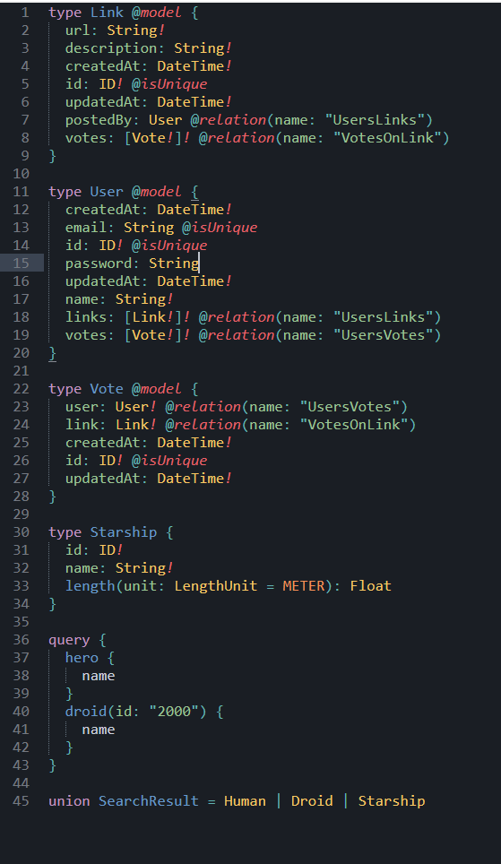

# GraphQL Pro Syntax Highlighting for Sublime Text 3

**This package supports Sublime Text 3 v3146+.

GraphQL Pro Syntax Highlighting for Sublime Text. Finally support syntax highlighting for your GraphQL IDL files!

## Installation and Use

1. [Install Package Control](https://sublime.wbond.net/installation)
2. `Package Control: Install Package` => `GraphQL Pro`

## Contributing

I'd appreciate any contribution to this project.
